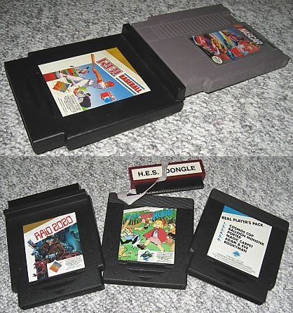

La NES amena une génération de titres signifiants et mémorables dans l’histoire du jeu vidéo. De nombreuses idées fondamentales peuvent être retracées à la librairie de la NES. Il y a de bonnes raisons pourquoi elle est la première console historique qui vient à l’esprit de la plupart des gens.

Mais dans l’ombre de son succès, plusieurs entreprises agissaient de façon hostile envers Nintendo. C’est ce que j’aime appeler **«&nbsp;la guerre de 10NES&nbsp;».** Dans cet article, j’expliquerai ce qu’est 10NES, les raisons de son existence, et ceux qui ont tenté de la déjouer, en vain, ou avec de lourdes conséquences.

<!--more-->

# Une licence pour les gouverner tous

[Dans le précédent article, j’ai expliqué le krach de 1983 et ses conséquences.](/article/le-krach-de-1983/) L’Atari 2600 fut écrasée par un nombre démesuré de développeurs tierces publiant une large quantité de jeux médiocres. Ce fut la plus grande récession de l’histoire de l’industrie du jeu vidéo. Nintendo ont parvenu à y mettre fin en sortant la NES aux États-Unis, qui fut une forte réussite commerciale.

Maintenant que Nintendo a conquis la place qu’Atari avait jadis, leur objectif le plus important fut de ne pas subir le même sort. Pour cela, **Nintendo mit en place un système de licence.** Un jeu ne pouvait être publié que sous les conditions suivantes&nbsp;:

-   **L’éditeur ne pouvait pas publier plus de 5 jeux par ans.** (Condition très restrictive pour éviter à tout prix le désastre de l’Atari 2600)

-   Seul Nintendo pouvait produire les cartouches pour l’éditeur. Aucun éditeur n’avait le droit de les produire eux-mêmes.

-   Le jeu devait être testé et approuvé par Nintendo pour assurer sa qualité.

-   Le jeu devait respecter les règles très strictes de Nintendo sur le contenu. (Pas de sang, de sexualité, de profanité, de violence, ou de symboles religieux.)

-   Le jeu ne pouvait pas être publié sur une console rivale avant que deux ans soient écoulés.

-   Il y avait un nombre minimum de cartouches pouvant être commandées, ainsi qu’un nombre maximum en constante fluctuation selon les capacités de Nintendo.



Le système de licence de Nintendo a réussi à empêcher la NES de vivre le même sort que l’Atari 2600. Mais ces restrictions étaient lourdes pour les éditeurs. Il était très prévisible que beaucoup auraient essayés de publier des jeux sans obtenir de licence. Mais pour le faire, ils devraient surmonter un adversaire redoutable&nbsp;: ***10NES***

# Plus se multiplient les lois et les ordonnances, plus foisonnent les voleurs et les bandits.

Pour faire respecter leur autorité, **Nintendo ont ajouté une puce dans la NES** et dans chaque cartouche. Cette puce empêche les jeux non-officiels de fonctionner. Elle s’appelle la «&nbsp;CIC&nbsp;» (Checking Integrated Circuit&nbsp;; Circuit intégré de vérification). Cette puce exécute un programme nommé 10NES. (Personnellement, je prononce ça «&nbsp;Ten Nesse&nbsp;».)

Pour plus de simplicité, j’appellerai les CIC les «&nbsp;puces 10NES&nbsp;», car la distinction entre les puces et le programme peut être difficile à suivre.



Quand une cartouche est insérée dans la console, la puce de la console et la puce de la cartouche sont activées simultanément. Elles peuvent communiquer directement à l’aide de deux connexions.

Les deux puces sont identiques en sois, mais à l’aide d’une broche, la puce dans la console s’initialise en mode «&nbsp;verrou&nbsp;» alors que la puce dans la cartouche est en mode «&nbsp;clé&nbsp;». Une analogie simple, la clé doit prouver son authenticité pour déverrouiller le verrou.

À un intervalle régulier, chaque puce enverra un «&nbsp;message&nbsp;» à l’autre. **Le message est déterminé par un algorithme arbitraire secret.** Puis, chaque puce vas vérifier que le message de l’autre répond bien aux attentes. Si c’est le cas, rien ne se passe, et l’échange se produira à nouveau au même intervalle.

Si le teste de validité après un échange échoue une seule fois, la puce «&nbsp;verrou&nbsp;» dans la console se bloquera et enverra constamment un signal au processeur pour le réinitialiser, ce qui redémarre continuellement la console, l’empêchant de lancer le jeu.



Et bien sûr, il était presque impossible de créer des clones. Le code exécuté sur la puce 10NES était secret. Il était très très difficile de l’extraire avec les technologies de l’époque. De plus, le système était breveté et le code était protégé par les droits d’auteurs.

Il est possible «&nbsp;d’espionner&nbsp;» les communications entre les deux puces en se branchant simplement sur la connexion. Mais l’algorithme est trop complexe pour pouvoir être compris en regardant simplement les messages. De plus, chaque message dépend du précédent et inclut également des nombres aléatoires, il n’est donc pas possible de simplement «&nbsp;rejouer&nbsp;» des messages sans les comprendre.

Pour finir, l’algorithme a une marge d’erreur, et peut valider des messages où certaines parties sont incorrectes. Cela peut être surprenant, mais à cause de cela, créer un clone parfait était encore plus difficile, car il est impossible de savoir si un code est réellement valide, ou suffisamment valide pour être toléré.

Ainsi, si quelqu’un parvenait à cloner l’algorithme par la force brute, Nintendo pourrait simplement modifier les futures consoles pour ne pas tolérer les erreurs commises par ce clone.

10NES fut incroyablement efficace. Le monde se souvient de la NES pour son catalogue de qualité, cela est certainement dû au contrôle étroit de Nintendo. Mais comme vous pouvez l’imaginer, tous les éditeurs ne voulaient pas jouer au jeu. 10NES a fait l’objet de nombreux examens approfondis, et plusieurs défauts furent trouvés.

# Comment déjouer Nintendo

## Méthode 1&nbsp;: Sacrifier un autre jeu

Les puces 10NES ne sont pas dépendantes du jeu auquel elles sont rattachées. Il est donc possible de prendre des puces venant de cartouches officiels et de la mettre dans une cartouche sans licence. Cette méthode est utilisée par beaucoup de passionnés de la NES, mais jamais commercialement, car ce serait simplement trop couteux.

Mais une entreprise australienne, HES, a eu l’idée de sortir des jeux sans licences qui se connectaient à l’extérieur à des cartouches officielles pour la vérification.

La première version du concept nécessitait un jeu légitime, ce qui rendait probablement les clients confus. Plus tard, ce fut remplacé par un «&nbsp;HES dongle&nbsp;», un périphérique vendu séparément qui intégrait une puce 10NES récoltée sur un autre jeu.

Étant donné que le client n’avait qu’à acheter une seule puce, l’approche était financièrement viable. Mais elle n’a fonctionné seulement parce que HES était une entreprise à forte présence en Australie. Il serait difficile de convaincre les consommateurs d’autres pays mieux servis par Nintendo d’utiliser des méthodes aussi peu conventionnelles pour jouer à un jeu.



Si vous voulez en apprendre plus sur HES, je vous recommande de [lire l’article de nesworld à leur sujet](https://www.nesworld.com/hes.php).

## Méthode 2&nbsp;: Neutraliser 10NES (sois-même)

Il s’avère que 10NES à des effets secondaires indésirables. Premièrement, la constante réinitialisation du processeur lors de l’échec fait vivement clignoter l’écran. Ceci est désagréable et, il s’avère, dangereux, à cause du risque de crises d’épilepsies, mais cela n’était pas encore bien compris à l’époque.

10NES considère l’absence de réponses comme un échec (ce qui est logique, sinon un jeu pourrait simplement ignorer ses signaux) et donc provoque le clignotement vif à chaque fois qu’aucun jeu n’est inséré.

Pire encore, il était possible à cause d’un dysfonctionnement que la puce 10NES de la cartouche et celle de la console démarrent de façon désynchronisée, ce qui causera un échec même si le jeu est authentique.

C’est le moment où beaucoup de personnes pensent qu’il faut «&nbsp;souffler sur la cartouche pour retirer la poussière&nbsp;». En réalité, **souffler sur la cartouche ne fait rien.**

La NES lit les jeux de façon électrique (ex. Carte SD), pas de façon optique (ex.  Lecteurs VHS ou DVD), donc un peu de poussière n’empêche pas la lecture. Dans la majorité des cas, les rares échecs de la NES à lire un jeu étaient dût à 10NES.

Et à ce moment-là, la même chose se produit, l’écran clignote vivement, ajoutant l’insulte à l’injure.

Un certain temps après la sortie de la console, une méthode fut découverte pour désactiver 10NES de façon permanente dans une console.

J’ai mentionné que les puces dans la console et celles dans les cartouches sont les même, et qu’**elles connaissent leur rôle à l’aide d’une broche.** La broche de la puce dans la console, le «&nbsp;verrou&nbsp;», est connectée, celle dans la cartouche, la «&nbsp;clé&nbsp;», ne l’est pas.

Or, il est possible de briser la broche de la puce dans la console pour la neutraliser. Cela est une manipulation très simple qui peut se faire sans aucune connaissance en électronique à l’aide d’un tourne-vis ou d’un coupe-ongles.

Cela est dû au fait qu’il n’y a rien à réinitialiser dans la cartouche. Nintendo n’avait pas prévus que des consommateurs briseraient la broche, et donc, quand la vérification échoue dans la clé (la cartouche), rien ne se passe. Donc en transformant le verrou en clé, le système est neutralisé.

Le brevet de Nintendo reconnait même cette possibilité, et mentionne que si deux clés essaient de se déverrouiller l’une et l’autre, «&nbsp;un état instable a lieu et aucune opération n’est effectuée&nbsp;».



Nintendo aurait pu corriger cette erreur dans une révision du système de la console, en reprogrammant 10NES pour qu’il essaye de réinitialiser la console même en mode clé. Mais en réalité, il existe d’autres manières de ressouder la console pour neutraliser 10NES. Par exemple, il serait peut-être possible de déconnecter l’horloge interne de la puce et la connexion vers la cartouche. Sans horloge interne, la puce attendrait la fin du délai pour toujours.

Ainsi, Nintendo s’est probablement rendu à l’évidence que si quelqu’un est suffisamment déterminé à neutraliser 10NES dans leur propre console, ils y parviendront éventuellement. La majorité des gens ne serait pas prêt à faire une telle modification, et si un jeu l’exigeait, le consommateur réaliserait certainement qu’il ne s’agit pas d’un original.

## Méthode 3&nbsp;: Électrocuter la puce

Plusieurs entreprises de jeux sans licence se sont rendu compte que 10NES peut être «&nbsp;paralysé&nbsp;» quand il reçoit un fort voltage négatif. Cette approche fut utilisée par Camerica, Color Dreams, et AVE. Si le nom Color Dreams vous semble familier, c’est peut-être parce qu’[un épisode du Joueur du Grenier de 2012 teste des jeux de l’entreprise.](https://www.youtube.com/watch?v=Xos2M-gTf6g) Un testament à leur médiocrité.

Ainsi, les cartouches de ces entreprises délivraient une charge de -3,5&nbsp;V à -5&nbsp;V à la puce 10NES pour la désactiver temporairement. Il est intéressant qu’ils ont tous développé leur propre circuit pour le faire, et qu’ils sont tous extrêmement confus pour quelque chose de plutôt simple. Il est possible qu’aucune de ces entreprises ne voulait qu’une autre ne comprenne leur méthode, car si la pratique devenait trop courante, Nintendo pourrait les rattraper.



Au bout d’un moment, ce fut le cas. Nintendo ont révisé le système de la NES et toutes les nouvelles unités produites avaient des résistances de 1&nbsp;K en séries sur la connexion de la puce 10NES, ainsi que des diodes qui empêchaient la tension négative. Cela rendait la puce 10NES «&nbsp;impossible à électrocuter&nbsp;».

AVE ont distribué des manuels pour expliquer aux gens comment couper la broche de la puce 10NES comme décrit dans la méthode précédente.

Si vous voulez voir plus de tentatives d’électrocution de la 10NES, je vous recommande de jeter un œil sur [la collection de Kevin Horton](http://www.kevtris.org/mappers/lockout/)&nbsp;!

## Méthode 4&nbsp;: **Créer une société fictive**

Au lieu de chercher des failles dans la sécurité de la NES, certains éditeurs ont cherché des failles dans le système de licence de Nintendo. Konami a trouvé la solution la plus simple et la plus efficace&nbsp;: former de nouvelles entreprises.

Ultra Games est une entreprise fictive fondé en 1988 en tant que subsidiaire à Konami. Elle n’avait donc pas d’employé, pas de bureau, mais c’était bien une entité légale distincte. Nintendo leur ont accordé leur propre licence, leur permettant de publier 5 jeux indépendamment à Konami. Dès que les conditions de Nintendo furent allégées en 1992, l’entreprise fut dissoute.

Mais il ne s’agit pas vraiment d’une faille, car en réalité, Nintendo avait le dernier mot. Il aurait pu décider de ne pas donner de licence à Ultra Games, mais a préféré fermer les yeux. Cette décision est probablement basée sur les antécédents de Konami. En 1987, l’entreprise a publié *Top Gun,* qui s’est vendu à 2 millions d’exemplaires (29e jeu le plus vendu sur la NES), et *Metal Gear,* le premier de la franchise, qui est un jeu très important dans l’histoire du jeu vidéo.

Cette technique ne permet pas de contourner le système, mais offre un avantage aux entreprises qui l’utilise. Nintendo pourrait leur retirer cet avantage à tout moment. Il y a peu d’entreprises comme Konami qui ont pu abuser de cette pratique, cela révèle sans doutes qu’il y a beaucoup plus de facteurs impliqués qu’on pourrait le penser.

## Méthode 5&nbsp;: Frauder et mentir au gouvernement

Après la prise de contrôle de Nintendo subséquente au crash de 1983, Atari était fou de rage et voulait à tout prix se venger de Nintendo. En 1988, Atari Games rejoint le camp des opposants au système de licence de Nintendo, et parvient à utiliser des méthodes très douteuses pour s’emparer du code source de 10NES.

L’histoire est très intéressante mais trop longue pour expliquer dans cet article. Je la partagerai dans le prochain article&nbsp;: **La vengeance d’Atari.**

# Un mal nécessaire

Ma conclusion sur cette histoire est que le système de licence de Nintendo est un exemple d’une décision qui ne bénéficie personne directement, et tout le monde à la fois.

Même si les frais de licence furent une source de revenus pour Nintendo, certaines limitations, comme de ne pouvoir publier que 5 jeux par ans, réduisait sa profitabilité. Elle réduisait aussi la liberté des éditeurs et le choix des consommateurs.

Mais c’est grâce à ce contrôle que le peu de jeux qui sortaient était de qualité. La supériorité de la NES bénéficiait le consommateur, l’éditeur, et Nintendo. Même si, comme nous allons le voir dans le prochain article, certaines conditions étaient trop strictes, le système de licence en lui-même fut une réussite pour tout le monde.

Je pense qu’il est parfois nécessaire d’accepter des restrictions raisonnables pour le bien commun. C’est quelque chose que nous avons souvent tendance à oublier, surtout en France.

Je ne recommande pas bien sûr d’accepter de vivre dans un régime totalitaire oppressif ou une dystopie communiste. Mais je pense qu’avant de s’opposer à une restriction, il faut réfléchir à son importance et comment son existence pourrait bénéficier à nous ou aux autres au long-terme.

Savoir quand il faut compromettre son bien-être pour celui des autres (encore une fois, *de façon raisonnable*) est selon moi, une exigence de la vie en société.

### Références

* <https://hackmii.com/2010/01/the-weird-and-wonderful-cic/>
* <https://www.nesworld.com/hes.php> (Note&nbsp;: 10NES y est erronément appelée la «&nbsp;Nin10&nbsp;»)
* <https://www.webcitation.org/5gP5WAVPj?url=http://home.freeuk.net/markk/Consoles/NES_Lockout.txt>
* <http://www.kevtris.org/mappers/lockout/>
* Et bien sûr Wikipédia&nbsp;: [NES](https://fr.wikipedia.org/wiki/Nintendo_Entertainment_System), [CIC (Nintendo)](https://en.wikipedia.org/wiki/CIC_(Nintendo)), [HES](https://en.wikipedia.org/wiki/Home_Entertainment_Suppliers)

## Images

* [Nintendo Seal of Quality vectorisé par Hope(N Forever)](https://commons.wikimedia.org/wiki/File:Original_Nintendo_Seal_of_Quality_emblem.svg)
* [Photo de la puce 10NES par Evan-Amos](https://commons.wikimedia.org/wiki/File:Nintendo-10NES-Lockout-Chip.jpg) (Domaine public)
* Les photos des cartouches HES furent empruntées de l’article de [nesworld.com](https://www.nesworld.com/index.php) suivant: <https://www.nesworld.com/hes.php>
* Photo de la puce 10NES avec la broche brisée par [GuaranteedGames](https://www.etsy.com/shop/GuaranteedGames) emprunté du listing Etsy suivant: <https://www.etsy.com/listing/491209816/nintendo-nes-console-system-w-super>
* [Plan du 2e circuit de Color Dreams par Kevin Horton](http://www.kevtris.org/mappers/lockout/cdreams3.html)
* [Scan du logo Ultra Games par Gamescanner](https://gamescanner.wordpress.com/2015/06/13/logo-ultra-games/)