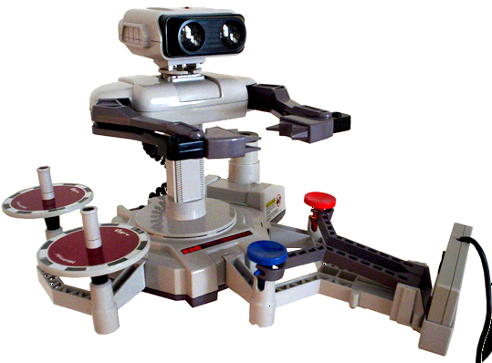

Je voulais originalement parler de la 10NES. Pour l’expliquer, il fallait que j’explique le fameux «&nbsp;krach du jeu vidéo de 1983&nbsp;». Mais cette partie est devenue trop longue, donc j’ai décidé de scinder cet article en deux&nbsp;!

Donc l’article d’aujourd’hui parle principalement d’histoire. Je vais expliquer le plus grand désastre de toute l’histoire du jeu vidéo, et comment Nintendo y ont fait face. Cet événement a changé la perception du jeu vidéo et a bouleversé l’industrie, et il est indéniable que le monde est très différent aujourd’hui à cause de cela. **Voici le krach de 1983.**

<!--more-->

# Le chaos du krach du jeu vidéo de 1983



Avant 1979, il n’y avait aucun développeur de jeux vidéos tierces sur consoles. L’[Atari 2600](https://fr.wikipedia.org/wiki/Atari_2600) était la console ayant de loin le plus de succès, et Atari était la seule entreprise publiant des jeux dessus. L’alternative était de publier des jeux en bornes d’arcades ou sur ordinateur. Malgré son succès, l’Atari 2600 était une plateforme strictement propriétaire.

Cela a changé en 1979 avec la fondation d’Activision. Activision fut fondé par des développeurs d’Atari qui avaient quitté l’entreprise, car ils voulaient être crédités et recevoir des parts des ventes des jeux auxquels ils contribuaient.

Au lieu de concevoir leur propre console, les développeurs ont utilisé leur expérience pour publier des jeux sur les consoles Atari. **Atari ont immédiatement poursuit Activision en justice,** mais le procès aboutit en 1982 avec la décision qu’Activision avait le droit de publier des jeux sur les consoles d’Atari tant qu’il lui payait des redevances.

Ainsi, la publication de jeux par des développeurs tierces était maintenant légitime. Cette délibération a surpris un grand nombre de personnes. Très vite, beaucoup d’entreprises ont pris part à une «&nbsp;ruée vers l’or&nbsp;» pour profiter autant que possible des consoles d’Atari. Cette nouvelle option était beaucoup plus facile et moins cher que de créer des bornes d’arcades, et l’Atari 2600 était beaucoup plus populaire que les ordinateurs pour le jeu vidéo.

Rapidement, le marché fut inondé par des jeux de très mauvaise qualité. La plupart étaient publiés par de grandes entreprises, le but étant seulement de capitaliser sur l’opportunité, il n’y avait aucun égard pour l’expérience utilisateur. Les autres étaient des jeux conçus par des développeurs amateurs n’ayant pas suffisamment étudié le support pour créer du contenu de qualité.

La pression mena Atari à prendre de très mauvaises décisions. En 1982, Atari avait fabriqué une large quantité de cartouches pour des jeux qu’ils pensaient vendre rapidement, E.T., et un portage de Pac-Man. (Le jeu étant originalement sorti sur arcade, il avait été reprogrammé pour l’Atari 2600.) Les deux furent un échec, et cela amena Atari à la célèbre décision de les enfouir dans le désert du Nouveau-Mexique.



Activision, quant à eux, ont réorienté leurs efforts pour publier des jeux sur ordinateurs, et très vite, ont entièrement cessé de publier sur l’Atari 2600.

Ainsi, le résultat inverse aux espérances des entreprises fut obtenu. L’industrie du jeu vidéo plongea dans la plus grande récession de toute son existence. **En 1985, elle était dans un état désastreux.**

C’est peut-être à cause de cette période qu’aujourd’hui, le jeu vidéo est toujours attribué un label de «&nbsp;faible culture&nbsp;». Beaucoup de personnes voient le jeu comme des jouets jetables et pas comme des œuvres d’art. Le jeu vidéo est probablement l’industrie artistique qui est entrée le plus vite dans une récession, et cela aurait influencé sa perception du grand public pendant très longtemps.

# Pas de catastrophe au Japon (pour une fois)

Le krach eu un faible impact au Japon, car l’arcade était beaucoup plus populaire que les consoles de salon. Au début de 1983, trois consoles de salon sont sortis au Japon. La MSX de Microsoft, la SG-1000 de SEGA, et la Famicom de Nintendo. Les trois consoles étaient nettement plus évoluées comparées à celles d’Atari.

À cause du krach, il y avait beaucoup moins d’enthousiasme pour le développement tierce, ce qui fut bénéfique. Les consoles japonaises ne virent pas le même sort qu’Atari. Ainsi, le marché du jeu vidéo au Japon vivait dans une bulle isolée au reste du monde.

La Famicom de Nintendo s’est placée au-dessus du reste. Trois ans après sa sortie, 6,5 millions de familles japonaises, soit 19&nbsp;% de la population, possédaient une Famicom. Ainsi, Nintendo voulait s’étendre internationalement.

Le succès de la [Game&Watch](https://fr.wikipedia.org/wiki/Game_and_Watch) et des bornes d’arcades de Nintendo en occident prouvait que les jeux de Nintendo pouvaient que leurs jeux pouvaient réussir en dehors du Japon. Mais le marché du jeu vidéo aux États-Unis était toujours en ruine, il serait difficile de convaincre les consommateurs d’acheter une nouvelle console. Nintendo avait la capacité à entrer dans le marché occidental, mais il faudrait se prouver extrêmement habile.

# Mario sauve le monde



La première étape fut de complètement remodeler la Famicom. Famicom voulait dire «&nbsp;Family Computer&nbsp;», ce n’était plus du tout au menu du jour. En lui donnant un design gris, industriel, en bloc, la console ne serait plus comparée à un ordinateur, **mais à un appareil multimédia comme un lecteur cassette.**

Elle fut renommée «&nbsp;la NES&nbsp;», la Nintendo Entertainment System, soit *le système de divertissement Nintendo.* On dirait le nom de quelque chose qu’on placerait à côté d’une chaîne Hi-Fi.

Nintendo ont fait des efforts considérables par rapport à leur communication. La NES ne serait pas vendue comme le futur de la technologie, car le public avait associé le futur de la technologie avec une montagne de jeux médiocres. À la place, la NES serait simplement vendue pour son aspect divertissant. Elle n’était pas un appareil électronique, **mais un jouet.** C’était la clé de la communication de Nintendo.

Avant d’être une entreprise de jeux vidéos, Nintendo était une entreprise de jouets depuis près d’un siècle, et la [Game&Watch](https://fr.wikipedia.org/wiki/Game_and_Watch) était une console qui avait déjà brouillé la ligne entre les jouets et les jeux vidéos. Mais pour être sûr de convaincre la plus grande majorité que la NES n’était pas comme les autres, Nintendo avait d’autres stratégies.



Lors de la sortie de la NES en Amérique en octobre 1985, le set avec lequel la NES était vendue, nommé le «&nbsp;Deluxe Set&nbsp;», comprenait deux jeux et accessoires. Premièrement, il y avait le NES Zapper et le jeu *Duck Hunt.* Le NES Zapper était un pistolet permettant au joueur de viser son écran, et de «&nbsp;tirer&nbsp;» sur différents objets à l’écran. Dans Duck Hunt, le joueur doit tirer sur des canards ou des assiettes dans un temps limité.

Dans un autre post, je vais détailler comment le NES Zapper et d’autres accessoires fonctionnaient, c’est très intéressant&nbsp;!

Il y avait aussi le R.O.B., «&nbsp;Robotic Operating Buddy&nbsp;» *(Compagnon d’opération robotique)* et le jeu *Gyromite.* Le R.O.B. était un jouet robot qui pouvait recevoir des signaux de l’écran et se tourner pour saisir des objets autours de lui.

Dans *Gyromite,* le joueur devait contrôler R.O.B. pour le faire prendre une toupie, la faire tourner, puis la poser sur le piédestal rouge ou bleu pour appuyer sur un bouton de la manette en bas à droite de l’image. Cela ouvrait et fermait des portes dans le jeu.

*Cela veut bien dire qu’il est possible de finir le jeu en appuyant le bouton soi-même, mais ce serait de la «&nbsp;triche&nbsp;».*

En réalité, R.O.B. avait un intérêt limité (seulement deux jeux officiels l’ont utilisé). Mais il était essentiel pour vendre la console comme un jouet. Le robot était affiché en évidence sur la boîte, d’une telle manière qu’il est probable que certaines familles l’ont acheté sans savoir qu’il s’agissait d’une console.

# De la mort provient la vie

Cette approche fut une réussite totale. La NES gagna très rapidement en popularité et fit de Nintendo une entreprise internationale.

Très vite, Nintendo devait empêcher la NES de vivre le même destin que l’Atari 2600. Ils y sont parvenus en réussissant à imposer des restrictions sur les développeurs tierces. Mais cela n’était pas aussi simple qu’on pourrait penser.

Je détaillerais ces restrictions et ceux qui ont tenté de les déjouer (en vain, ou avec de lourdes conséquences) dans un prochain article intitulé **«&nbsp;La 10NES et la guerre pour publier des jeux&nbsp;»**&nbsp;!

Il est intéressant de se dire qu’il est possible que Nintendo ne serait probablement pas là où ils sont aujourd’hui sans le krach de 1983. Je pense que c’est une leçon que l’univers nous rappel constamment&nbsp;: de la mort provient la vie. La fin de quelque chose marque toujours le début de quelque chose d’autre. Le krach a marqué la fin d’une génération de développeurs de jeux vidéos, mais aussi le début d’une nouvelle.

Souvent, il vaut mieux rester optimiste de ce qui va venir que de se lamenter de ce que l’on a perdu.

### Références

* https://www.mcmrose.com/nintendo-nes-deluxe-set-complete-guide-and-prices/
* https://book.famicom.party/chapters/01-briefhistory.html
* https://arstechnica.com/gaming/2013/07/time-to-feel-old-inside-the-nes-on-its-30th-birthday/
* https://www.snopes.com/fact-check/five-million-et-pieces/
* Et bien sûr sur Wikipedia&nbsp;: [Video game crash of 1983](https://en.wikipedia.org/wiki/Video_game_crash_of_1983), [Nintendo Entertainment System](https://en.wikipedia.org/wiki/Nintendo_Entertainment_System), [Atari 2600](https://en.wikipedia.org/wiki/Atari_2600), [Enfouissement de jeux vidéo par Atari](https://fr.wikipedia.org/wiki/Enfouissement_de_jeux_vid%C3%A9o_par_Atari)

### Images

* [L’image de couverture incorpore une photo de Taylorhatmaker](https://commons.wikimedia.org/wiki/File:Atari_E.T._Dig-_Alamogordo,_New_Mexico_(14036097792).jpg) ([CC-BY](https://creativecommons.org/licenses/by/2.0/deed.fr))
* Image de [l’Atari 2600](https://commons.wikimedia.org/wiki/File:Atari-2600-Wood-4Sw-Set.jpg), [la Famicom](https://en.wikipedia.org/wiki/File:Nintendo-Famicom-Console-Set-FL.jpg), et [la NES](https://en.wikipedia.org/wiki/File:NES-Console-Set.jpg) par Evan-Amos (Domaine public)
* [Photo de l’extraction des jeux Atari enfouis par Taylorhatmaker](https://commons.wikimedia.org/wiki/File:Atari_E.T._Dig-_Alamogordo,_New_Mexico_(14039327125)_edit.jpg) ([CC-BY](https://creativecommons.org/licenses/by/2.0/deed.fr))
* [Photo du Deluxe Set par Wooly Matt](https://www.flickr.com/photos/woolner/2173297756) ([CC BY-NC-ND](https://creativecommons.org/licenses/by-nc-nd/2.0/deed.fr))
* [Photo de R.O.B. par Phil Bond](https://commons.wikimedia.org/wiki/File:Gyromite_ROB.jpg) ([CC BY-SA](https://creativecommons.org/licenses/by-sa/3.0/deed.fr))